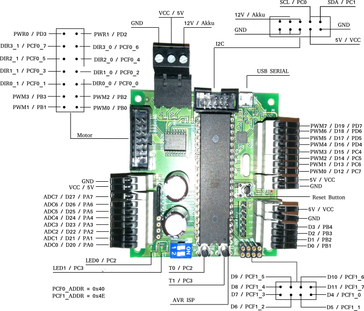

# Goldboard4 Version 2.2

* 
* 
* 

## Hardware

Die Pins des Atmega32 sind am Goldboard4 wie in der folgenden Grafik belegt. PAx, PBx, PCx, und PDx sind die Ports des AVR. ADCx sind die Analogpins der Goldboard lib. Dx sind die Digitalpins der Goldboard lib.
Die Nummern stimmen mit der lib überein.

## software

[Dokumentation](https://teeheee.github.io)

## Entwicklungsumgebung

* [Atmel Studio 7 Anleitung](README_AS7.md) ([Download AS7 Template](https://github.com/teeheee/goldboard4/raw/master/goldboard4-V2.2-AS7-template.zip))
* [Atom  mit PlatformIO Anleitung](README_ATOM.md) ([Download Atom Template](https://github.com/teeheee/goldboard4/raw/master/goldboard4-V2.2-AtomPio-template.zip))
* [Makefile Anleitung](README_MAKE.md)

## Windows Treiber

Normalerweise sollte der in Atmelstudio mitgelieferte Treiber ausreichen.

* [Atmelstudio 7](https://www.microchip.com/mplab/avr-support/atmel-studio-7)
* [Zadig Treiber installations Tool](https://zadig.akeo.ie/)
* [FTDI für Serialport](https://www.ftdichip.com/Drivers/VCP.htm)

## TODO
* full test
   * ~motors~
   * servos
   * ~pwmpins~
   * ~digitalpins~
   * ~analogpins~
   * ~buttons~
   * ~leds~
   * robot->bluetooth->pc
   * robot->bluetooth->robot
   * ~power pins~
   * CMPS11
   * ~CMPS03~
   * ~SRF08~
   * SRF10
   * VL53L0X
   * ~pixy~
   * ~usring~
   * ~lcd~
* make clean doxygen comments
* upgrade servo PWM to every pin
* check race condition on interrupts
* add i2c hang up recovery
