# Goldboard4 Version 2.2

## Hardware

Die Pins des Atmega32 sind am Goldboard4 wie in der folgenden Grafik belegt. PAx, PBx, PCx, und PDx sind die Ports des AVR. ADCx sind die Analogpins des Goldboard. Dx sind die Digitalpins des Goldboard.
Die Nummern stimmen mit der lib überein.

## Entwicklungsumgebung

### Atmelstudio 7

Vorraussetzung für die folgenden Schritte ist eine erfolgreiche installation von Atmelstudio 7.

#### Template importieren

Das [Atmelstudio 7 Template](https://github.com/teeheee/goldboard4/raw/master/goldboard4-2.1-AS7-template.zip) muss als erstes heruntergeladene werden und in den Template Ordner eurer Atmelstudio installation importiert werden.
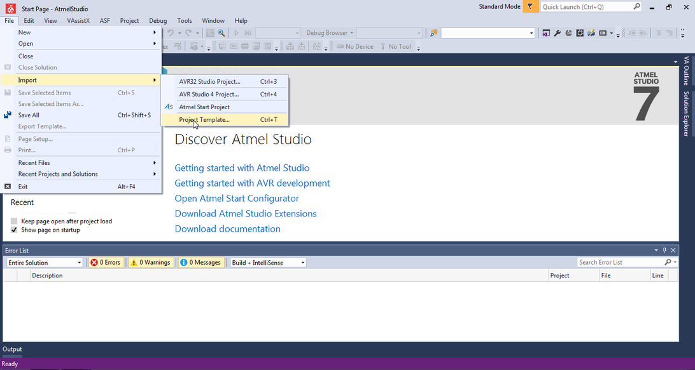
Hier müsst ihr das heruntergeladene Template auswählen.
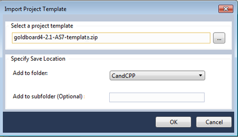

#### Projekt erstellen

Um ein Porjekt zu erstellen geht ihr wie gewohnt vor.

Vergesst nicht den Namen und den Ort (Location) eures Projekts zu ändern damit ihr es später wieder findet.
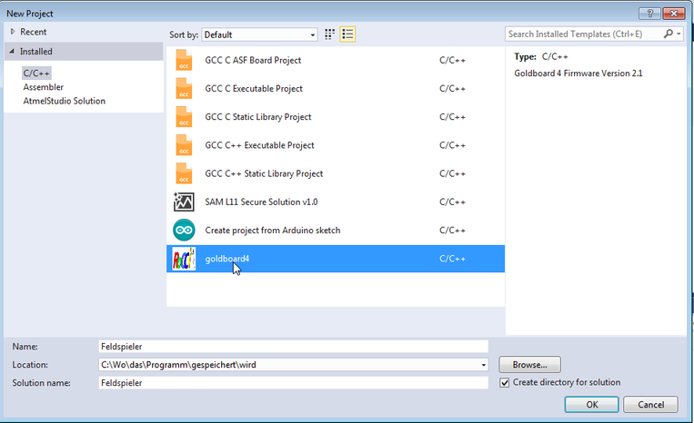

#### Fuses setzen und Bootloader hochladen

Unter Tools->Device Programming habt ihr die Möglichkeit, euren Programmer direkt zu steuern.
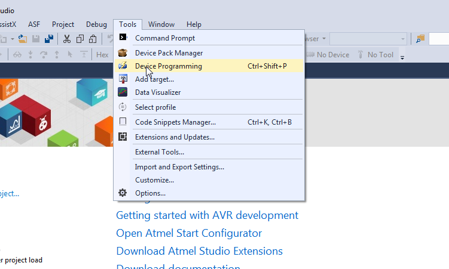
Dazu wählt ihr euren Programmer und den verwendeten AVR (Atmega32) aus und drückt Apply.
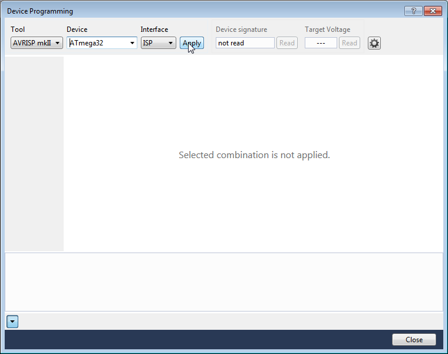
Falls hier ein Fehler auftritt überprüft ob euer Goldboard richtig angeschlossen ist und unter Strom steht. Außerdem kann es vorkommen, dass der Treiber nicht richtig installiert wurde.

Zum setzen der Fuse Bits schreibt folgende Hex Zahlen in die Felder für Low Byte und High Byte und drückt Programm!

* Low Byte:   0xFF
* High Byte:  0xD4

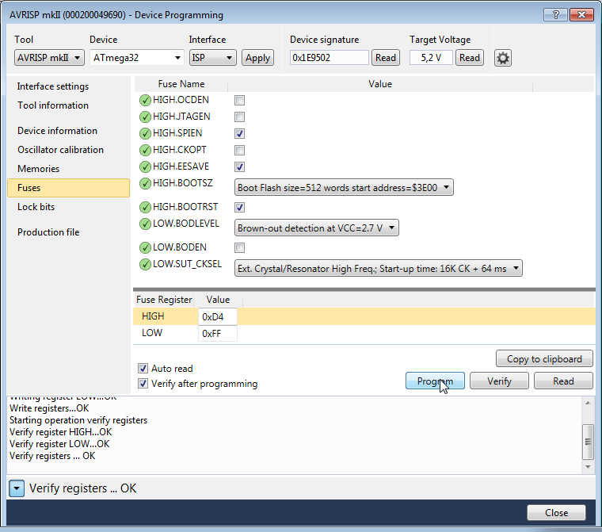

Um den Bootloader hochzuladen wählt die in eurem projekt enthaltene datei bootloader_mega32_optiboot.hex aus. Diese findet ihr in dem Ordner utils. Durch drücken von program ladet ihr den Bootloader hoch. Wenn keine Fehler auftreten, sollte die Led am Goldboard blinken.

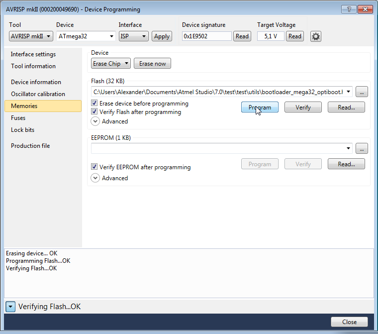

#### Programmer für Bootloader konfigurieren

zum Hochladen über usb müsst ihr euren Programmer wie folgt konfigurieren. Kopiert folgende Zeile in das Command Feld:

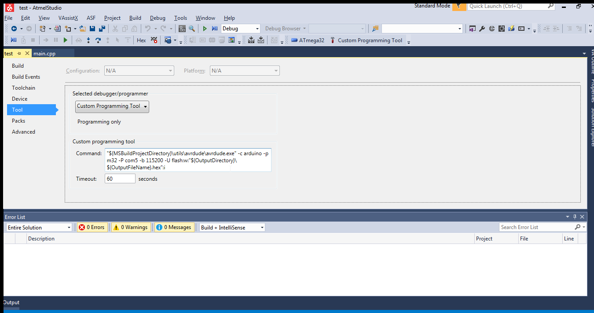

>"$(MSBuildProjectDirectory)\utils\avrdude\avrdude.exe" -c arduino -p m32 -P com5 -b 115200 -U flash:w:"$(OutputDirectory)\$(OutputFileName).hex":i

Je nachdem unter welchem COM-Port euer Goldboard erkannt wird, müsst ihr
"com5" in z.B. "com3" ändern.

## Atom mit Platform-IO Plugin

Vorraussetzung für die folgenden Schritte ist eine erfolgreiche installation der Atom-IDE.

### Installation des Platform-IO Plugin
Das Plugin wird über den internen plugin manager installiert. Eine internetverbindung ist nötig.
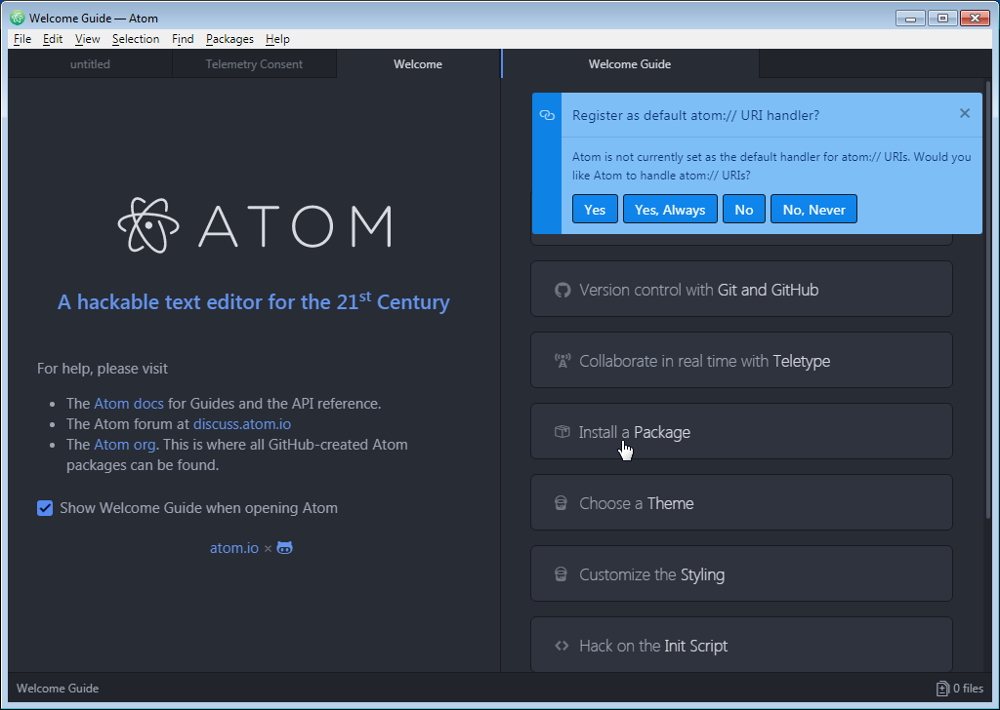
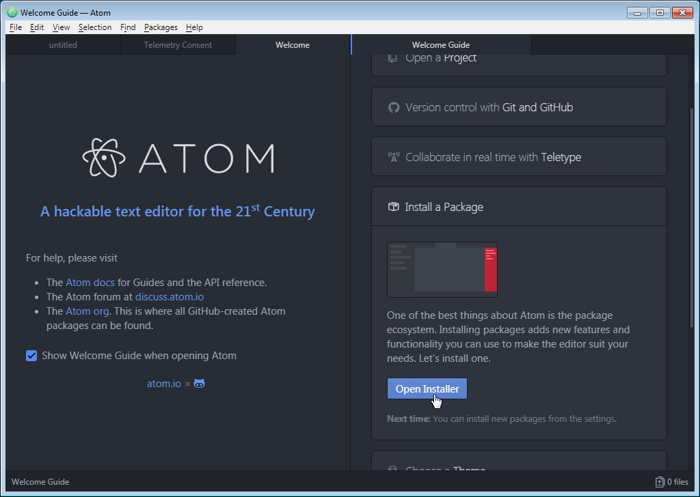
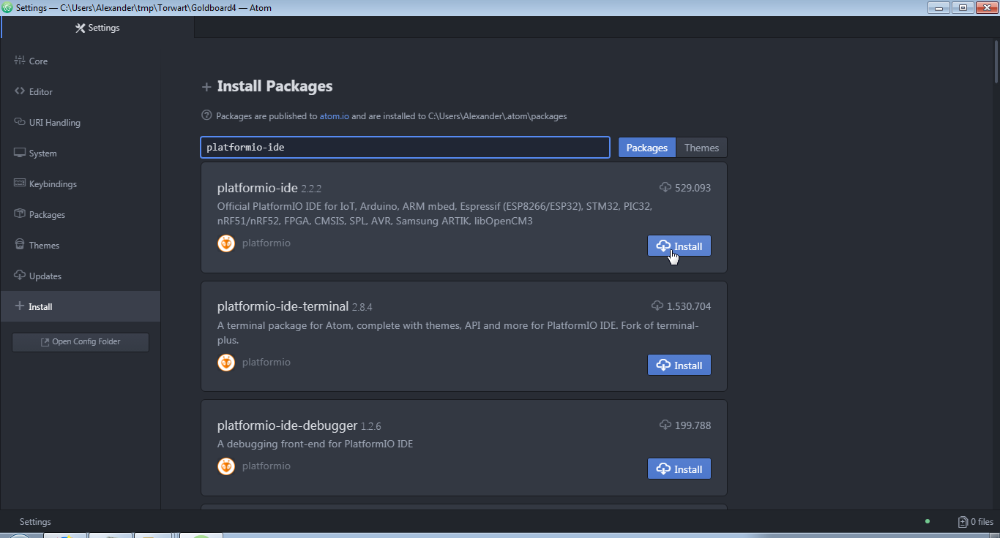
Die installation von Clang ist optional.
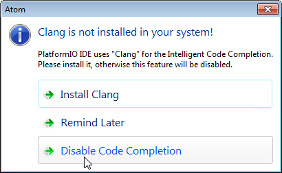

### Projekt erstellen

Um ein neues Projekt zu erstellen muss das [Platform IO Template](https://github.com/teeheee/goldboard4/raw/master/goldboard4-AtomPio-template.zip) heruntergeladen werden und an dem bevorzugten Speicherort extrahiert werden. Es bietet sich an das Template Archiv für später zwischen zu speichern.
Mit dem Menüpunkt Add Projekt Folder kann der Ordner geöffnet werden.

Die main.cpp findet ihr im src Ordner. Mit dem Haken am linken Rand könnt ihr Compilieren. Der Pfeil ist fürs übertragen. Der Stecker links unten ist für den Seriel Monitor.
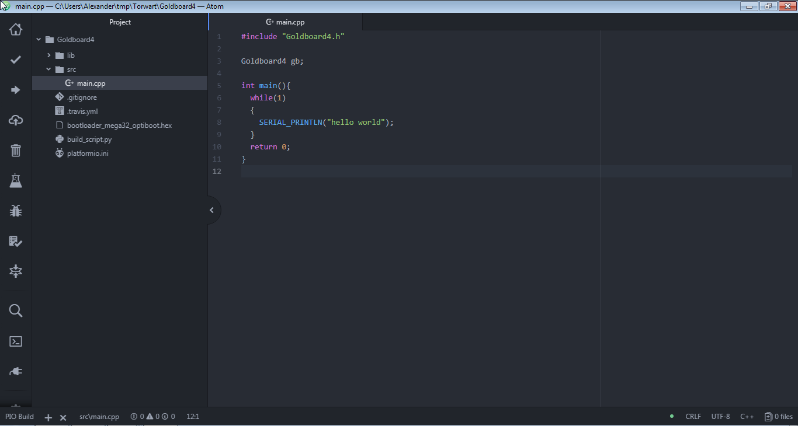
Damit der Serialmonitor funktioniert muss die Baudrate 115200 eingestellt werden.
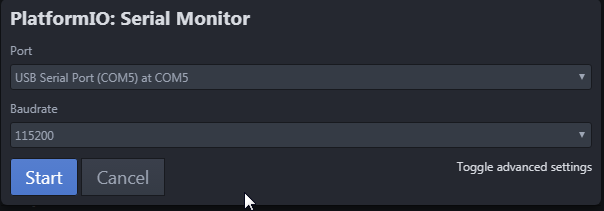

### Fuses und Bootloader übertragen

Um die Fuses und den Bootloader übertagen zu können muss in platformio.ini ein Programmer ausgewählt werden der keinen Bootloader benötigt.
Also entweder stk500 oder avrispmkii.

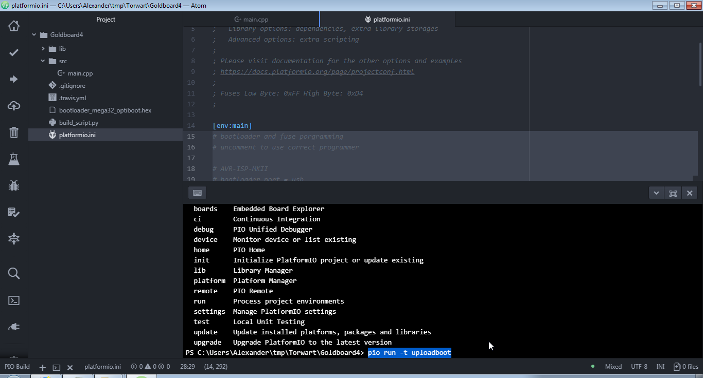
Nun könnt ihr links unten über das Terminal Symbol eine Konsole öffnen und folgende Befehle eingeben.
Für den Bootloader:

> pio run -t uploadboot

Für die Fuses:

> pio run -t uploadboot

Es werden nun automatisch die richtigen Fuses oder der Bootloader übertragen. 
Beim übertragen des Bootloaders sollte die Led am Goldboard blinken.

### Andere Befehle

Um die neusten Goldboardlibs herunterzuladen:
> pio run -t update

Um den simulator zu starten falls er mal irgendwann funktioniert :-D
> pio run -t simulate

Nur compilieren
> pio run

Übertragen und compilieren
> pio run -t upload

## Makefile for users without a GUI

### Dependencies:
avr-libc gcc-avr make avrdude

### Compile:
make

### Upload:
make program

## TODO
* full test
   * ~motors~
   * servos
   * ~pwmpins~
   * ~digitalpins~
   * ~analogpins~
   * ~buttons~
   * ~leds~
   * robot->bluetooth->pc
   * robot->bluetooth->robot
   * ~power pins~
   * CMPS11
   * ~CMPS03~
   * ~SRF08~
   * SRF10
   * VL53L0X
   * ~pixy~
   * ~usring~
   * ~lcd~
* make clean doxygen comments
* upgrade servo PWM to every pin
* check race condition on interrupts
* add i2c hang up recovery
