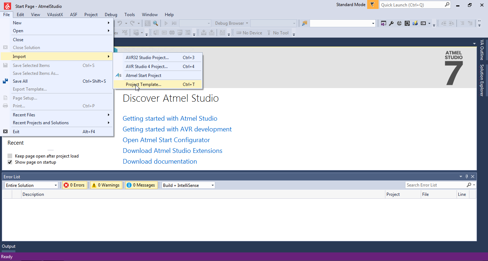

# Goldboard4 Version 2.1

## TODO
* full test 
   * ~motors~
   * servos
   * ~pwmpins~ 
   * ~digitalpins~
   * ~analogpins~
   * ~buttons~
   * ~leds~
   * robot->bluetooth->pc
   * robot->bluetooth->robot
   * ~power pins~
   * CMPS11
   * ~CMPS03~
   * ~SRF08~
   * SRF10
   * VL53L0X
   * ~pixy~
   * ~usring~
   * ~lcd~
* make clean doxygen comments
* upgrade servo PWM to every pin
* check race condition on interrupts

## Benutzung

### Atmelstudio 7

Um die Goldboardlib verwenden zu können muss zuerst das Projekt Template importiert werden.

#### Template importieren

File->Import->Project Template...

Select a project template [...] -> "<path>/goldboard4-2.1-AS7-template.zip" -> OK

#### Projekt erstellen

File->New->Project...

goldboard4_V2.1->OK
Projektname und Pfad nicht vergessen!!

#### Fuses setzen

Tools->Device Programming
Apply
Fuses

Low Byte: 0xFF 
High Byte: 0xD4

#### Bootloader hochladen

Der Bootloader muss mit einem ISP Programmer (z.B. Avr-ISP-mkII) hochgeladen werden.

Tools->Device Programming
Apply
Memories->Flash->[...]
bootloader_mega32_optiboot.hex auswählen
program

#### Programmer für Bootloader konfigurieren

Zum hochladen über usb wird das Programm avrdude benötigt.
http://download.savannah.gnu.org/releases/avrdude/avrdude-6.3-mingw32.zip

C:\WinAVR\bin\avrdude -c arduino -p m32 -P com5 -b 115200 -U flash:w:"$(OutputDirectory)\$(OutputFileName).hex":i

## Atom with Platform-IO plugin

###

## Makefile (for Linux users and/or Visual Studio haters)

### Dependencies:
avr-libc gcc-avr make avrdude

### Compile:
make

### Upload:
make program

